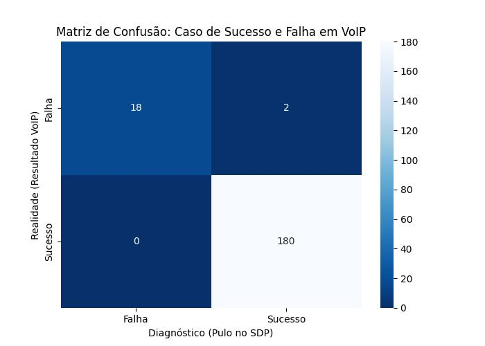

# 🎙️ Um Caso VoIP na Matriz de Confusão

## 1. O Contexto (O Problema de Engenharia)
* **Abertura:** Durante minha trajetória na AudioCodes, participei de um processo crítico de certificação em uma das maiores operadoras do Brasil. Tínhamos um problema de falhas intermitentes em chamadas VoIP, o que gerava um impasse técnico na fase de certificação de nosso produto, um IAD VoIP.
* **A Abordagem:** Analisei profundamente todos os aspectos da sinalização VoIP (principalmente os protocolos SIP - Session Initiation Protocol - e SDP - Session Description Protocol. Gerei 200 chamadas manualmente (não havia ferramenta de automação na época), capturei os logs internos do produto a cada chamada, junto com a captura WireShark dos pacotes SIP/SDP. A base de dados era enorme, e ela revelaria a causa raiz do problema intermitente!

## 2. A Estratégia Analítica (Pensamento de Engenharia)
* **Métrica de Sucesso:** O sucesso era conseguir isolar o culpado pelas falhas. Portanto, eu não buscava Acurácia Geral. O objetivo a métrica da  **Precisão**, de preferência de 100% na Classe Negativa (a falha).
* **O Porquê:** Eu precisava garantir que o fator técnico que eu havia isolado fosse o causador direto da falha. Não podia então haver **Falsos Negativos (FN)** — afinal, eu precisava isolar a causa raiz. O FN, que corresponde a prever uma falha em uma chamada que teve sucesso, invalidaria a prova técnica perante a operadora.
  
 

## 3. Defesa Técnica da Matriz de Confusão
* **Explicação dos Resultados:** * Obtive **100% de Precisão na Falha**: Todo alarme de falha gerado era uma falha real (0% de erro de 'alarme falso de falha' ou FN).
    * "Obtive **90% de Recall na Falha**: Meu diagnóstico explicou a grande maioria dos problemas (18 de 20 casos reais). Os 10% que 'escaparam' são os **Falsos Positivos (FP)**, indicando que a causa principal foi isolada, mas poderiam existir variáveis residuais."

[Image of Precision and Recall formulas explained]

## 4. A Ponte para a Educação (O Valor para o Grupo SEB)
* **Transposição de Conceito:** "Essa mesma maturidade analítica é o que trago para a **EdTech**. Na gestão escolar, lidamos com trade-offs constantes entre precisão e sensibilidade."
* **Exemplo Prático:** "Se implementamos um modelo para prever a evasão de alunos (Churn):
    * Priorizamos a **Precisão** para não sobrecarregar os tutores com alertas falsos? 
    * Ou priorizamos o **Recall** para garantir que nenhum aluno em risco seja esquecido, mesmo que